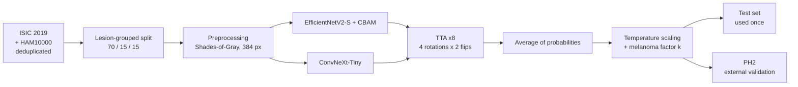

# Skin lesion classification (7 classes) — leakage-free, calibrated, externally validated

Dermoscopic skin-lesion classifier trained on **ISIC 2019** (7 classes shared with HAM10000), with an ensemble of
**EfficientNetV2-S + CBAM** and **ConvNeXt-Tiny**, a clinically calibrated operating point for melanoma, and external
validation on **PH2**.

The focus of this project is **evaluation rigour** rather than a leaderboard score: lesion-grouped splits, a test set
used only after every decision was made on validation, 95 % confidence intervals everywhere, and an honest report of
what did *not* work.

> ⚠️ Research project only. This is **not** a medical device and must not be used for diagnosis.

---
## 🔬 Demo

Upload a dermoscopic image → calibrated class probabilities, melanoma decision at the clinical operating point,
and a Grad-CAM heatmap of the regions that drove the prediction.

- **Run it yourself (free, no install):** [Kaggle notebook](https://www.kaggle.com/code/rihembousbih/skin-lesion-classification-live-demo) → *Copy & Edit* → *Run All* → open the `gradio.live` link.
- **Model weights:** [huggingface.co/RihemBousbih/skin-lesion-effnet-convnext](https://huggingface.co/RihemBousbih/skin-lesion-effnet-convnext)

https://github.com/user-attachments/assets/5d082ef1-07ec-45c1-9e2f-60a0e0b022ab

---

## Final results (held-out test set, 3,738 images)

95 % CIs from a **lesion-grouped bootstrap** (2,000 resamples).

| Operating point | Accuracy | Macro-F1 | Melanoma sensitivity | Melanoma specificity | Macro AUC |
|---|---|---|---|---|---|
| Argmax (raw) | **0.874** [0.861–0.886] | **0.831** [0.802–0.856] | 0.749 [0.711–0.788] | 0.964 [0.956–0.971] | **0.981** [0.977–0.985] |
| Calibrated (melanoma sensitivity ≥ 0.85 on validation) | 0.852 [0.838–0.864] | 0.817 [0.787–0.843] | **0.845** [0.813–0.874] | **0.908** [0.896–0.920] | 0.981 |

**External validation — PH2** (197 images, 52 melanomas, different hospital and dermatoscope, never seen in training):
melanoma AUC **0.850** [0.779–0.914]; at the calibrated operating point, sensitivity 0.712 [0.585–0.828] and
specificity 0.910 [0.861–0.957].

Per-class F1 (raw): akiec 0.75 · bcc 0.91 · bkl 0.77 · df 0.81 · nv 0.92 · mel 0.79 · vasc 0.86.

---

## Pipeline

| Component | Choice |
|---|---|
| Data | ISIC 2019 (7 classes: akiec, bcc, bkl, df, nv, mel, vasc) + 197 HAM10000 images absent from ISIC 2019 |
| Splits | `GroupShuffleSplit` by `lesion_id`: train 17,455 / val 3,707 / test 3,738; 0 shared images or lesions (checked) |
| Colour constancy | Shades-of-Gray (p = 6), at training **and** inference |
| Augmentation | flips, 90° rotations, random crop 70–100 %, colour jitter, cutout, mixup (α = 0.1) |
| Class imbalance | class-balanced sampling ∝ √n (no duplication), label smoothing 0.1 |
| Optimisation | AdamW, cosine schedule with warm-up, mixed precision, 2 × T4 (Kaggle) |
| Inference | 8-view TTA; simple average of the two models (no weights fitted) |
| Calibration | temperature scaling + a single multiplicative factor on the melanoma probability, fitted on validation |

---

## Notebooks

Run in this order on Kaggle; each notebook reads the outputs of the previous ones.

| # | Notebook | Role | GPU |
|---|---|---|---|
| 01 | `01_entrainement_effnet.ipynb` | Data merging and deduplication, lesion-grouped split, EfficientNetV2-S + CBAM training (head, then progressive fine-tuning), first calibration | ~12 h |
| 02 | `02_evaluation.ipynb` | Bootstrap CIs for V1, PH2 evaluated at the same operating point as the test set | CPU |
| 03 | `03_phase3.ipynb` | Final fine-tuning phase (mixup + balanced sampling) with automatic restart on NaN; checkpoint ensemble (rejected on validation) | ~4.5 h |
| 04 | `04_convnext_ensemble.ipynb` | Second, architecturally different backbone (ConvNeXt-Tiny) and ensemble; paired bootstrap vs single model | ~6 h |
| 05 | `05_final.ipynb` | Part 1: patient metadata stacking (negative result). Part 2: NaN diagnosis + `NanGuard`, ConvNeXt continuation, EfficientNet-B4, ensemble selection on validation, final calibration, test and PH2 | ~6 h |

> Note: checkpoint files named `resnet50_cbam_*.keras` actually contain the **EfficientNetV2-S + CBAM** model (the name
> is a leftover of an earlier ResNet50 prototype and is kept because later notebooks load these paths).

---

## Progression

Every decision (checkpoint, ensemble, calibration) was taken on **validation**; the test set was only read afterwards.

| Version | Model | Test acc. | Test macro-F1 | Macro AUC | Calibrated: mel sens. / spec. | PH2 mel AUC |
|---|---|---|---|---|---|---|
| V1 (01–02) | EfficientNetV2-S + CBAM, final phase cut short by NaN | 0.829 [0.816–0.841] | 0.735 [0.702–0.763] | 0.969 | 0.836 / 0.843 | 0.871 |
| Phase 3 (03) | same, final phase completed | 0.860 [0.850–0.871] | 0.790 [0.759–0.816] | 0.974 | 0.851 / 0.884 | 0.859 |
| Ensemble (04) | + ConvNeXt-Tiny | 0.871 [0.861–0.881] | 0.831 [0.805–0.853] | 0.981 | 0.852 / 0.892 | 0.848 |
| + Metadata (05, part 1) | + age, sex, site stacker | not retained (no gain in cross-validation) | – | – | – | – |
| **Final (05, part 2)** | EfficientNetV2-S + CBAM + ConvNeXt-Tiny (continued) | **0.874** [0.861–0.886] | **0.831** [0.802–0.856] | **0.981** | **0.845 / 0.908** | 0.850 |

The CIs for V1 to the ensemble (04) come from an image-level bootstrap; the final row uses the lesion-grouped bootstrap.

Adding ConvNeXt-Tiny gave a significant paired gain over EfficientNet alone: +4.1 macro-F1 points,
95 % CI [+2.0, +6.3]. The last step improved the calibrated operating point (+1.6 points of melanoma specificity at the same
sensitivity) but not the raw accuracy significantly (+0.3 points, CI [−0.1, +0.7]).

Single models (test, raw):

| Model | Accuracy | Macro-F1 | PH2 mel AUC |
|---|---|---|---|
| EfficientNetV2-S + CBAM | 0.860 | 0.790 | **0.859** |
| ConvNeXt-Tiny (v1) | 0.854 | 0.797 | 0.815 |
| ConvNeXt-Tiny (continued) | 0.861 | 0.827 | 0.800 |
| EfficientNet-B4 | 0.856 | 0.802 | 0.839 |

---

## Findings

1. **Dataset overlap.** 98 % of HAM10000 images are already in ISIC 2019. Splitting the two datasets separately would
   have leaked training images into the test set; they were merged and deduplicated before splitting.
2. **Where the NaN came from.** Training repeatedly diverged to NaN in mixed precision, for both architectures. A
   diagnosis over 1,500 training batches found **no non-finite input** — the cause is the float16 model, not the data.
   A `NanGuard` callback (snapshot of weights + optimiser state every 50 batches, rollback on NaN) let training finish
   instead of stopping or restarting.
3. **Calibration.** Replacing 7 per-class thresholds by a single melanoma factor gave a more stable operating point and
   better specificity at 85 % sensitivity (0.908 vs 0.892).
4. **Architectural diversity matters more than checkpoint diversity.** Averaging checkpoints of the same run did not
   help; adding a different backbone did.
5. **Negative result — metadata.** Age, sex and anatomical site added nothing on top of the two CNNs (−0.05 accuracy
   points in cross-validation).
6. **Domain shift.** As the models fit ISIC better, PH2 performance slightly *decreased* (mel AUC 0.871 → 0.850). With
   52 melanomas this trend is not significant, but it suggests the models learn ISIC-specific cues.

---

## Operating point trade-off (test)

Melanoma factor chosen on validation for each target sensitivity, then applied to the test set:

| Target sensitivity (val) | Accuracy | Macro-F1 | Mel sensitivity | Mel specificity |
|---|---|---|---|---|
| 0.75 | 0.872 | 0.831 | 0.752 | 0.959 |
| 0.80 | 0.872 | 0.834 | 0.804 | 0.945 |
| **0.85** | 0.852 | 0.817 | 0.845 | 0.908 |
| 0.90 | 0.817 | 0.801 | 0.901 | 0.844 |

---

## Limitations

- **Dermoscopy only.** The models were trained on dermoscopic images; smartphone photos are out of distribution.
- **Label noise.** The 197 HAM10000 images added as `akiec` are most likely Bowen's disease, which ISIC 2019 labels
  as SCC (a class excluded here).
- **Residual leakage.** Lesion identifiers exist only for the HAM10000-derived part of ISIC 2019; BCN20000 images of
  the same lesion may appear in different splits.
- **Test set reuse.** The same test set was read after each version. All choices were made on validation, but the
  final figure is still slightly optimistic.
- **CBAM.** No ablation was run; this work makes no claim that CBAM improves performance. ConvNeXt-Tiny, without
  attention, performs on par with EfficientNetV2-S + CBAM.
- **Small external set.** PH2 has 52 melanomas, hence wide CIs.

---

## Reproducing

1. Add the Kaggle datasets `cdeotte/jpeg-isic2019-512x512`, `surajghuwalewala/ham1000-segmentation-and-classification`,
   `kmader/skin-cancer-mnist-ham10000` and `spacesurfer/ph2-dataset` as inputs.
2. Run the notebooks in order, each with the outputs of the previous ones as inputs.
3. Final metrics are saved in `run_config_final.json` and per-image predictions in `final_predictions_test.csv`.

Model weights: `<link to Hugging Face / Kaggle>` (too large for GitHub).

